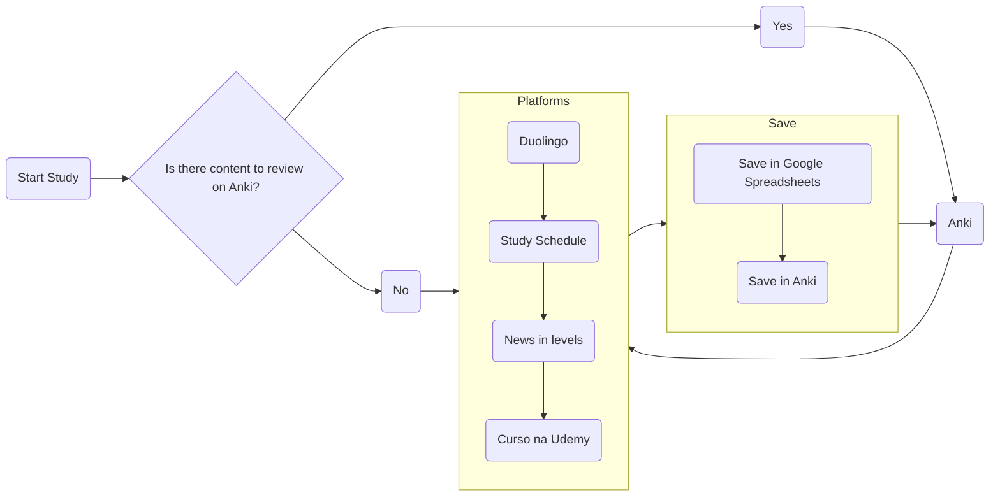

# English-Studies
## Study diary
This repository is my study diary

Notes and study flow: [Notion.io](https://www.notion.so/English-Studies-e41c955cbf9d41d887e98418b9da7ffd?pvs=4)

```mermaid
flowchart LR

A(Start Study)
A?B{Is there content to review on Anki?}

duolingo(Duolingo)
y(Yes)
n(No)
anki(Anki)
ankisave(Save in Anki)
spreadsheetssave(Save in Google Spreadsheets)
studySchedule(Study Schedule)
newsinlevels(News in levels)
udemy(Curso na Udemy)


A-->A?B-->y-->anki-->Platforms
A?B-->n-->Platforms

subgraph Save
      direction TB
      spreadsheetssave -->ankisave
end

subgraph Platforms
	direction TB
	duolingo -->studySchedule --> newsinlevels -->udemy
end

Platforms-->Save
Save-->anki

click anki "https://ankiweb.net/decks/" _blank
click ankisave "https://ankiweb.net/decks/" _blank
click duolingo "https://www.duolingo.com/learn" _blank
click studySchedule "https://www.nacaofluente.com/blog/como-aprender-ingles-no-youtube/" _blank
click newsinlevels "https://www.newsinlevels.com/" _blank
click spreadsheetssave "https://docs.google.com/spreadsheets/d/1arlHxIkvthya-5m9DFAn3_cooVw2jMa86urfHyFg8ZE/edit#gid=0" _blank
click udemy "https://viasat.udemy.com/course/reiniciar-seu-ingles-do-zero/learn/lecture/8256838#overview" _blank
```

